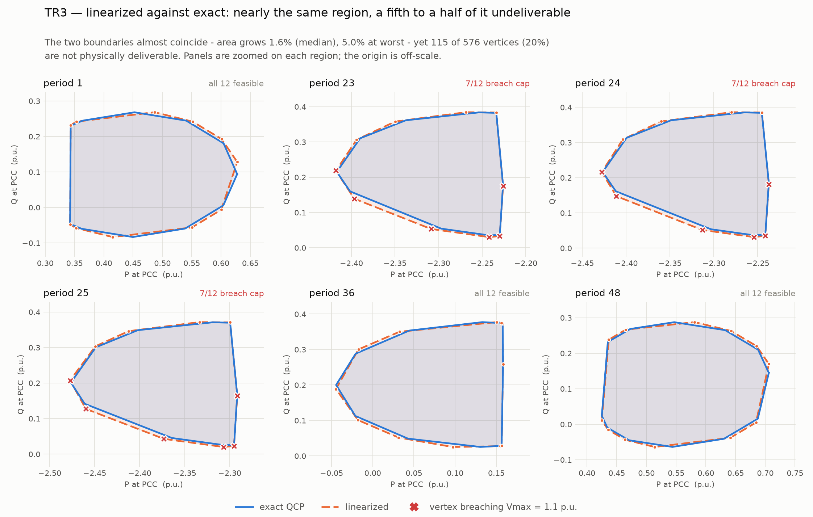
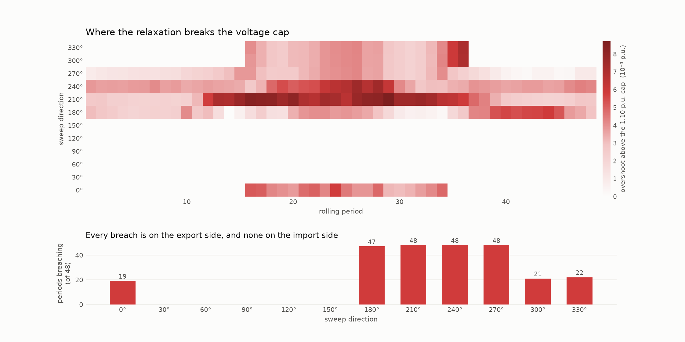

# What the linearized formulation costs — measured on TR3 and TR7

**August 2026.** The production model solves the exact quadratic form. The alternative
linearizes two constraints — a 16-gon for the inverter capability curve (`FOR_PolyS=1`)
and a tangent plane for the voltage cap (`FOR_LinearizeVmax=1`). That was the historical
whole-feeder configuration, and it is about 28 % cheaper per solve.

This is the first direct measurement of what it costs. Two transformers, chosen to
bracket the range: **TR3** (49 batteries, second-lowest `LinErr` of the nine — close to
a best case) and **TR7** (259 batteries, the worst-conditioned by `LinErr`). Each is a
pair of runs differing in nothing but those two switches.

---

## 1. The finding

> **The region barely changes size. Between a fifth and a half of its boundary cannot be
> delivered, and on the larger transformer the committed dispatch diverges as well.**

| | TR3 (49 batt) | TR7 (259 batt) |
|---|---:|---:|
| Region area, median | +1.6 % | +1.3 % |
| Region area, max | +5.0 % | +5.0 % |
| **Vertices breaching the true voltage cap** | **115 / 576 — 20.0 %** | **253 / 576 — 43.9 %** |
| Periods with ≥1 breach | 23 / 48 | **48 / 48** |
| Worst true voltage (cap 1.10) | 1.10521 | **1.10873** |
| Committed SOC diverged | 0 / 48 periods | **13 / 48 periods** |
| Max SOC divergence | — | **0.221** (22 % of capacity) |
| Mean solve | 5.92 s vs 8.24 s exact | 51.41 s vs 71.09 s exact |
| Status | 576/576 Optimal both | 576/576 Optimal both |

TR3 is the mild case and it already loses a fifth of its boundary. **TR7 loses 44 %, in
every period of the day.**

---

## 2. The relaxation contains the exact region — where the comparison is valid

Both linearizations are **outer** relaxations: the tangent plane lies below the convex
`Vre² + Vim²`, so `tangent ≤ MaxV²` is weaker than the true constraint, and the 16-gon
circumscribes the inverter S-circle. The linearized region must therefore contain the
exact one in every direction.

| | comparable directions | larger | equal | **smaller** |
|---|---:|---:|---:|---:|
| TR3 | 576 / 576 | 576 | 0 | **0** |
| TR7 | 420 / 576 | 203 | 217 | **0** |

**996 valid comparisons, not one exception.** That is worth stating in the paper as an
empirical confirmation of containment, not merely an algebraic claim.



The two boundaries almost coincide. That is the trap: judged by eye, or by area, the
linearized region looks fine.

### Why 156 of TR7's directions are excluded

`RunFOR_Rolling` solves the **committed baseline under the same formulation as the
sweep**. So a linearized run executes a different dispatch, and the SOC it carries into
the next period drifts. On TR7 the trajectories separate from period 19, peak at a
divergence of **0.221 — 22 % of battery capacity — at period 27**, and re-converge by
period 32:

```
p01–p18   1e-6      (identical)
p19       3.0e-03
p20–p26   3.5e-02 … 8.9e-02
p27       2.2e-01   <- worst
p28–p31   8.6e-02 … 2.4e-02
p32–p48   1e-6      (identical again)
```

From period 19 the two runs are computing regions **from different physical states**, so
a direction-by-direction comparison there is not a comparison of formulations. Those 156
directions are excluded from the containment check above — that is where all 44 apparent
"smaller" values came from, and they are not counter-examples.

**This divergence is itself a second cost, and arguably the more serious one.** The
relaxation does not merely mis-draw the offered region; it changes the dispatch the
prosumers actually commit to. TR3 showed none of this. TR7 shows it on a quarter of the
day.

---

## 3. Where it fails



The breaches are **systematic in both direction and time**, on both transformers:

| direction | TR3 (periods of 48) | TR7 (periods of 48) |
|---|---:|---:|
| 0° | 13 | 19 |
| 180° | 21 | **47** |
| 210° | 21 | **48** |
| 240° | 21 | **48** |
| 270° | 19 | **48** |
| 300° | 10 | 21 |
| 330° | 10 | 22 |
| **30°–150°** | **0** | **0** |

Sweep directions **30°–150° never breach**, in any period, on either transformer. On TR3
the breaches cluster at the midday PV peak; on TR7 three directions breach in **every
period of the day**.

> **Careful with that table.** Those are *sweep directions* — the angle of the objective —
> not the sign of the power flow, and the two are not the same thing. Read direction 0°,
> which maximises P yet still breaches, as the warning against conflating them.

Classified by the **actual power** at the vertex rather than by direction, the picture is
sharper and only partly matches:

| | breaching / total | mean P of breaching | mean P of clean |
|---|---:|---:|---:|
| TR3, exporting (P ≤ 0) | 114 / 312 | −1.914 | −0.184 |
| TR3, importing (P > 0) | **1 / 264** | | |
| TR7, exporting (P ≤ 0) | 188 / 345 | −0.960 | −0.201 |
| TR7, importing (P > 0) | **65 / 231** | | |

So: **breaches concentrate where the feeder exports hardest** — the breaching vertices
average ten times the export of the clean ones on TR3. On the small transformer importing
is effectively untouched (1 of 264). **On the large one it is not: more than a quarter of
importing vertices breach too.** Do not state this as "the import side is safe."

That concentration is the physics, not a numerical accident. Export raises feeder voltage,
the cap binds, and the tangent plane lets the solver push past it. `VmaxTrue` is 1.10000 on
all nine transformers in the exact campaign, so the voltage cap is what *sets* the region
boundary — which is exactly why relaxing it goes straight into the answer.

---

## 4. Why this matters more than the area number

A FOR is a set of promises: every point on the boundary is an operating point the DSO
could dispatch. Under linearization, between one in five and nearly one in two of those
promises is false, and the false ones concentrate at heavy export — the commercially
interesting corner, and the one a flexibility market would actually call on. On the large
transformer they are not confined to it: a quarter of the importing vertices fail as well.

An area-based argument misses this completely. 1.3–1.6 % sounds tolerable. Half the
boundary being undeliverable is not.

The saving does not justify it: 28 % per solve on both transformers, on a formulation
the parallel-sweep campaign already made 1.82× faster overall. Both runs returned
576/576 Optimal, so there is no robustness argument either.

**Conclusion: publish exact.** These files are the evidence; before them the repository
asserted "~1 % larger" with no measurement behind it.

---

## 5. Reproducing it

```
! in AIMMS, one transformer per fresh session, close without saving
RunTR3_Base   / RunTR3_Linear      ! 49 batteries,  ~20 min each
RunTR7_Base   / RunTR7_Linear      ! 259 batteries, 5.2 h exact, 3.5 h linearized

py -3 scripts/compare_linearization.py --tag TR3
py -3 scripts/compare_linearization.py --tag TR7
```

The switch is `RollLinearized` (default 0 = exact production). `RunFOR_Rolling` pinned
`FOR_PolyS` and `FOR_LinearizeVmax` to 0 outright before that parameter existed, so a
wrapper could not reach them.

`VmaxTrue` and `OVviol` are computed from the exact voltages in both runs, which is what
makes any of this measurable: they say whether a vertex is deliverable regardless of the
formulation that produced it.

## 6. Files

| file | what |
|---|---|
| `<TAG>_linearization.xlsx` | Summary, all 576 Vertices side by side, PerPeriod areas, ByDirection, Violations |
| `<TAG>_linearization_regions.png` | FOR polygons, exact against linearized, breaching vertices marked |
| `<TAG>_linearization_overshoot.png` | overshoot heat map by period and direction, plus breaches per direction |
| `scripts/compare_linearization.py` | builds all three; `--tag` works for any transformer with both runs |

The `Vertices` sheet carries `soc_divergence` and `comparable` per row, so the
containment check can be re-derived on whichever subset a reader trusts.
